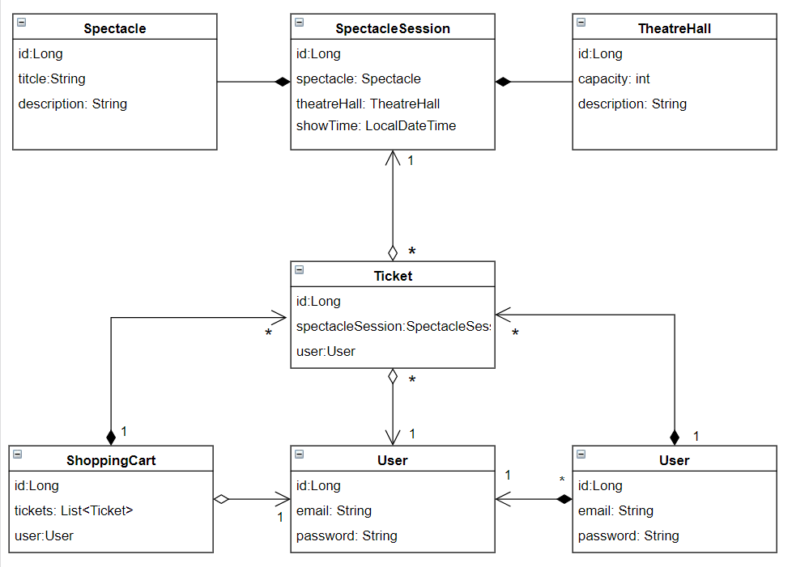

## Opera-tickets-app
A prototype of an online store selling opera tickets with
basic functionality, written in Java with Hibernate, Spring and MySQL as database.

This project was build according to N-tier architecture and SOLID principles.

### Project structure

___UML diagram that describes the relationship between the
entities.___

### Technologies

* Hibernate
* Spring MVC
* Servlet API
* SQL
* Maven
* Tomcat

### Configuration

- Download and open this project in an IDE.
- Remote MySQL DB connection was already configured. You can set up a new one in "src/main/resources/db.properties"
- Configure Tomcat (Local) with
  * Deployment - war_exploded
  * Context address - "/"
- Run a project
